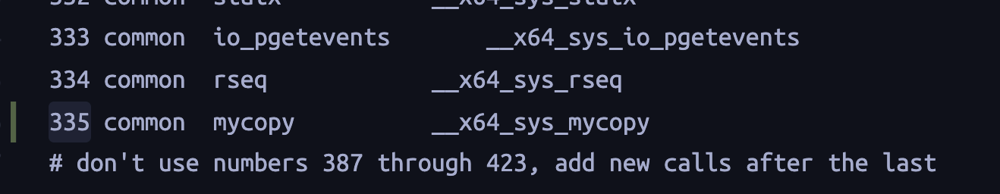

## 添加系统调用xx
* [参考-1](https://medium.com/anubhav-shrimal/adding-a-hello-world-system-call-to-linux-kernel-dad32875872)
* [参考-2](https://zhuanlan.zhihu.com/p/31342840)
* [内核编程](http://docs.ifjy.me/contents/linux/002/linux%E5%86%85%E6%A0%B8%E7%BC%96%E7%A8%8B%E7%AC%94%E8%AE%B0.html)
## make 
> make mrproper # 清除make的生成物
## qemu
* 运行编译后的Linux
## I/O函数
> ksys_read
> Since version 4.14 of Linux kernel, vfs_read and vfs_write functions are no longer exported for use in modules. Instead, functions exclusively for kernel's file access are provided: QAQ
## 建立交换区
### 使用文件建立
* 创建大小为512M的交换文件：
> dd if=/dev/zero of=/swapfile1 bs=1024k count=512
* 使用 mkswap 命令来设置交换文件：
> mkswap /swapfile1
* 启用交换分区：
> swapon /swapfile1
/proc/swaps 或 free 命令的输出来确保交换分区已被启用了。


### 具体过程
#### 获取源文件
* [官网下载最新的稳定版即可](https://www.kernel.org/)
* 解压源码到/usr/src: `tar -xvf linux-5.4.tar.gz -C/usr/src`(本人使用的是5.4，后面涉及到版本的数字与你的版本对应即可)

#### 分配系统调用号
* 切换到源文件目录下：`cd /usr/src/linux-5.4`，此时使用`pwd`：/usr/src/linux-5.4
* 我把系统调用函数名定为`mycopy`，`cd /usr/src/linux-5.4/arch/x86/entry/syscalls`，修改syscalls目录下面的 syscall_64.tbl 文件,我使用的版本可以分配的系统调用号可以从335开始，

#### 添加系统调用定义
* 在`/usr/src/linux-5.4/include/linux/syscalls.h`添加自定义系统调用函数的申明


#### 添加函数定义
* 在`/usr/src/linux-5.4/kernel/sys.c`添加
```c
SYSCALL_DEFINE2(mycopy,const char __user *,src, const char __user *,dst){
	int f;
	int dest;
	struct kstat k_buffer;
	int FILE_MAX_LEN = 256;
	int read_size = 0;
	int write_size = 0;
	long total = 0;
	char buf[512];
	char src_file[256];
	char dst_file[256];
	mm_segment_t fs = get_fs();
	set_fs(KERNEL_DS);
	memset(buf, 0, 512);
	memset(src_file, 0, FILE_MAX_LEN);
	memset(dst_file, 0, FILE_MAX_LEN);

	if(strncpy_from_user(src_file,src,FILE_MAX_LEN) < 0){
    	printk(KERN_INFO "copy from src failed\n");
		set_fs(fs);
		return -EFAULT;
	}
	if(strncpy_from_user(dst_file,dst,FILE_MAX_LEN) < 0 ){
    	printk(KERN_INFO "copy from dst failed\n");
		set_fs(fs);
		return -EFAULT;
	}
    printk(KERN_INFO "src file: %s,dst file: %s",src_file,dst_file);

	if(vfs_stat(src_file,&k_buffer)){
		printk(KERN_INFO "get stat failed\n");
		set_fs(fs);
		return -3;
	}

	if ((f = ksys_open(src_file, O_RDONLY, S_IRUSR)) == -1) {
		printk(KERN_ALERT "open src file  error!!.\n");
		set_fs(fs);
		return -EFAULT;
	} 
	printk(KERN_INFO "open src file sucess!!.\n");

	
	if ((dest = ksys_open(dst_file, O_WRONLY | O_CREAT | O_TRUNC, k_buffer.mode)) == -1) {
		printk(KERN_ALERT "open dst file error!!.\n");
		set_fs(fs);
		return -EFAULT;
	} 
	printk(KERN_INFO "open src file sucess!!.\n");
	// Get current segment descriptor
	
	while ((read_size = ksys_read(f, buf, sizeof(buf))) > 0) {
		printk(KERN_INFO "read_size:%d\n", read_size);
		write_size = ksys_write(dest, buf, read_size);
		printk(KERN_INFO "write_size:%d\n", write_size);
		total += write_size;
		memset(buf, 0, 512);
	}
	if(read_size < 0){
		printk(KERN_INFO "open dst file error!!.\n");
	}
	ksys_close(f);
	ksys_close(dest);
	set_fs(fs);
	return total;
}
```
### 编译
* 运行内存小的话先挂一个swap区，上面有方法
* 在源文件的根目录下，` sudo make menuconfig `,直接保存退出
* 然后编译 `sudo make `
* 安装 `sudo make modules_install install`
* 重启 `shutdown -r now `

